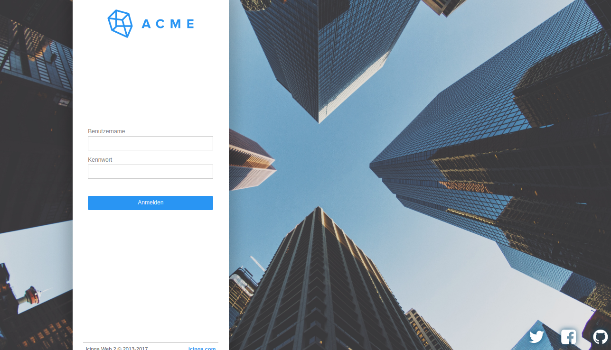
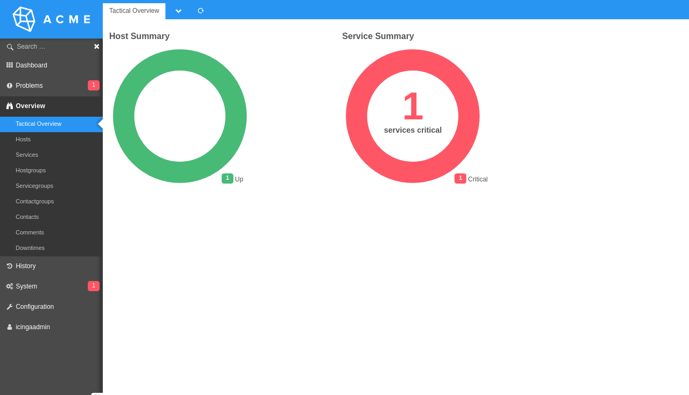
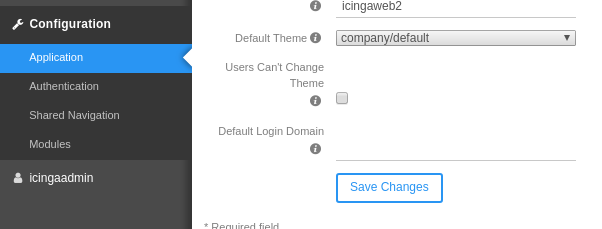
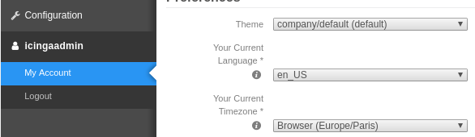

Company Theme example for Icinga Web 2
======================================

This is an example to give you an idea how to start modifying the theme
of Icinga Web 2 to your needs.

Requires:
* Icinga Web 2.5 or newer

Only a few things are tweaked right now:

* Main logo in the interface replaced by a corporate logo
* Colors of Icinga tuned for a corporate CI
* Login background changed

In every theme, the base theme of Icinga Web 2 is applied, and modifications need to be
added incrementally.

You can find the overall theme on [GitHub](https://github.com/Icinga/icingaweb2/tree/master/public/css/icinga)
or on your local system under `/usr/share/icingaweb2/public/css/icinga`.

## How to install

Install these theme repository like any other Icinga Web 2 module at:

    /usr/share/icingaweb2/modules/company
    
Enable the module:

    icingacli module enable company
    
Then you can select the theme in the admin or user UI.

Tweak it to your needs, you can also change the module name or
incorporate the files into your own module.

## Contribution

Feel free to add your ideas and examples here as well. Just add or modify a theme.

## License

Unless otherwise noted the license of these examples is Public Domain.

Icinga Web related examples were created by: [Markus Frosch](mailto:markus.frosch@icinga.com)

The ACME Logo was taken from [acmelogos.com](http://acmelogos.com) by
[Mackenzie Child](https://www.youtube.com/watch?v=QxeXfUmBvPU&feature=youtu.be).
No specific license was documented there, but the purpose seems to be
intended for free-use.

Other images:

* `samson-duborg-rankin-91091` [Samson Duborg-Rankin on Unsplash](https://unsplash.com/photos/ZGjbiukp_-A)
